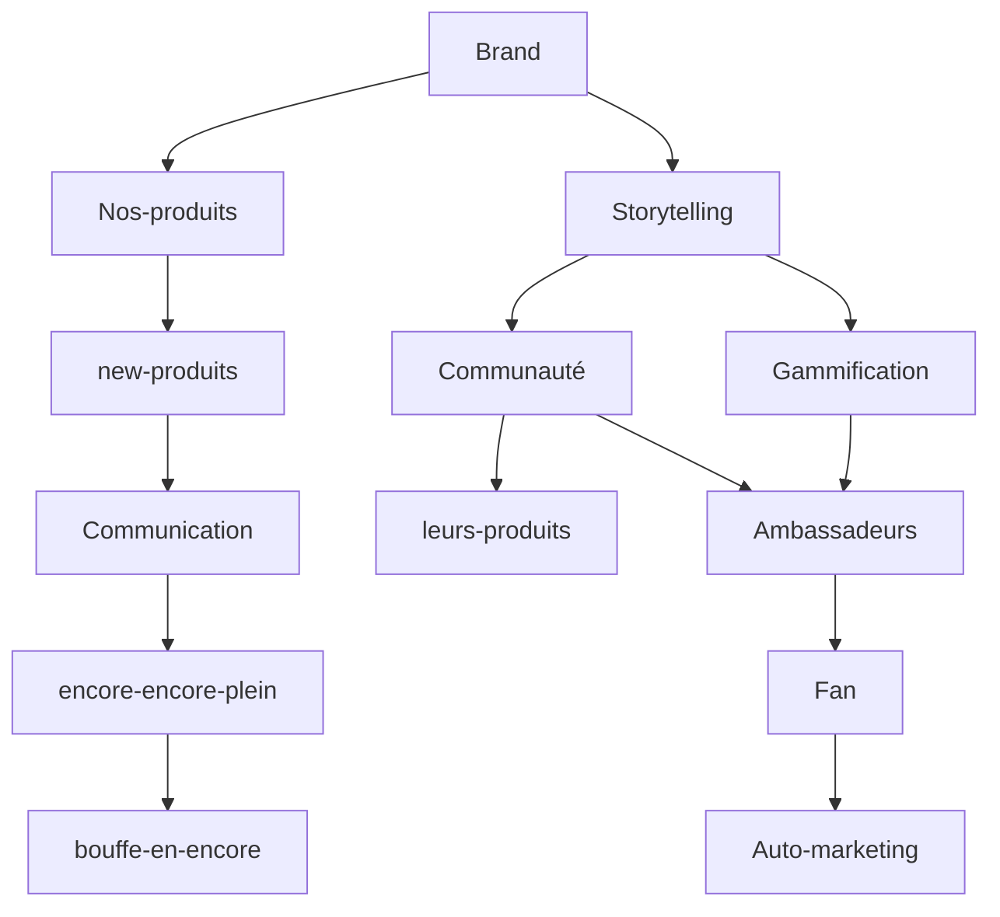

<h1 align="center">
   
  
   - Midi pot - 
</h1>
<h4 align="center">Projet de vente de controller, synthé et autres outils de lowcost music</h4>

  <a href="https://github.com/Sercurio/MIDIPots/pulls">Contribution</a> &bull;
  <a href="https://wiki.seeedstudio.com/license/">License MIT seeed</a>

## Descriptif

*Proposer des controller USB-midi, synthétiseur et autre adaptateur DIY.*

## Comment

 1. <b>Proposer 3 formules d'un même produit:</b>
 
	 a. Le plug & play
   
	 b. Le Kit à monter DIY
   
	 c. Le kit à souder
   
 2. <b>Produits:</b>
 
	 a. controller pad - <i>USB-midi</i>
   
	 b. controller pots - <i>USB-midi</i>
   
	 c. controller mix - <i>USB-midi</i> + <i>midi in & out</i>
   
	 d. controller enc - <i>Jack 3.5</i> + <i>midi in & out</i>
	 
     e. **controller natif ableton**-* <i>USB-midi</i> + <i>midi in & out</i>
   
 3. <b>Mersh</b>

## Étude de Faisabilité  

1. [Financière](https://docs.google.com/spreadsheets/d/1GwxuASy16Rr7--z_Ch776Jr25UZVG92z4cuzJGJ9izQ/edit#gid=1201407305)

	 a. [fournisseurs](#)
   
2. Technique

    a. [software](#)
    
    b. [hardware](https://www.easyeda.com)
    
 3. [Design](#)
    
    a. Façade aimenté interchengeable
 
 4. Shop

## Direction marketing

Le produit est déstiné à la communauté des Maker, tel que Arduino, Hackster, Tindie,
Créer un entonnoamification pour fidéliser les clients.

<i>**NB:** Ne pas perdre de vue que ce produits à sa niche de passionné déja bien installé et qu'ils finiront par améliorer nos produits les détourner, et se les approprier. Donc... </i>

#### Partir sur un produit dit Hackable 
 - UART et SPI accessible 
 - Shield plug&play aimmenté
 - Façade aimenté interchangrable

#### Donc, trouver notre réel business model - que vendons nous? 
- Un produits 
-  Une histoire

 

#### Nos points faibles:
- [ ] Nous ne répondons pas à un besoin. Cela existe déja.
- [ ] Nous n'avons aucune innovation pour nous démarquer du marché existant.
- [ ] Le marché est blindé de produit similaire.

#### Nos points fort:

 - [ ] Nous sommes dans LA ville 
 - [ ] Nous sommes trois compétences
 - [ ] On peut se lancer sans bcp d'investissement
 - [ ] Indépendant sur la R&D et les prototypages.
 - [ ] Réseaux clients existant
 - [ ] Visibilité et premier vente sur shop existant [RDH]
 - [ ] Réseaux ambassadeurs existant [DJ, festival]

 

**Bilan** : peut fonctionner en local la première années. Devra lever des fonds la deuxièmes sinon aucune évolution possible en dehors du marché "souterrain" en mode artisans. 

 

### Comment je vois le plan à première vue:

<h1 align="center"> 2022 v-1.0.0</h1>
<h5 align="center">| Louis | Max  | wam respectivement| dev  | design | goal volant |</h5>
